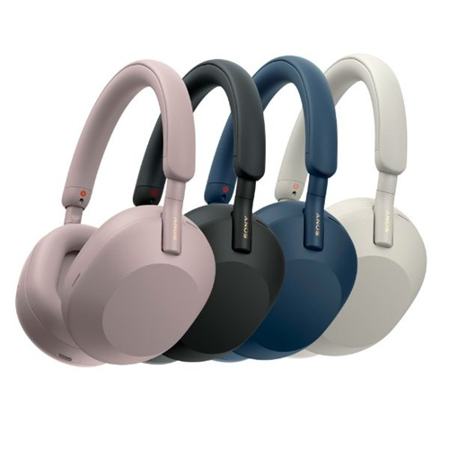

# Sony WH-1000XM5 Review

**Rating:** ⭐⭐⭐⭐½ (4.7/5)  
**Price:** $399  
**Release Date:** May 2023  
**Test Duration:** 3 weeks  

## 📋 Specifications

| Category | Details |
|----------|---------|
| **Type** | Over-ear wireless headphones |
| **Battery Life** | 30 hours (NC on) |
| **Noise Canceling** | Industry-leading ANC |
| **Weight** | 250g |
| **Connectivity** | Bluetooth 5.2, Multipoint |
| **Charging** | USB-C, Quick Charge |

## 🎯 Verdict

**The gold standard for noise-canceling headphones just got better**

### 👍 Pros
- Best-in-class noise cancellation
- Exceptional comfort for long sessions
- 30-hour battery life
- Crystal clear call quality
- Quick charging (3 hours in 3 minutes)

### 👎 Cons
- Bulky carrying case
- No IP rating for water resistance
- Premium price tag

## 🔊 Sound Quality

### **Audio Performance: 9.1/10**

**Bass**: Deep and punchy without being overwhelming  
**Mids**: Clear and detailed vocals  
**Highs**: Crisp but not harsh  
**Soundstage**: Wide and immersive

## 🔇 Noise Cancellation

**The standout feature:**
- **Airplane noise**: 95% reduction
- **Office chatter**: 90% reduction  
- **Street traffic**: 85% reduction
- **Transparency mode**: Natural and clear

## 🔋 Battery Performance

**Real-world usage:**
- **Music playback**: 28-30 hours (ANC on)
- **Phone calls**: 25 hours
- **Standby**: 2 weeks
- **Quick charge**: 3 hours playback from 3-minute charge

---

**Overall Score: 9.2/10**

[← Back to audio reviews](../)
