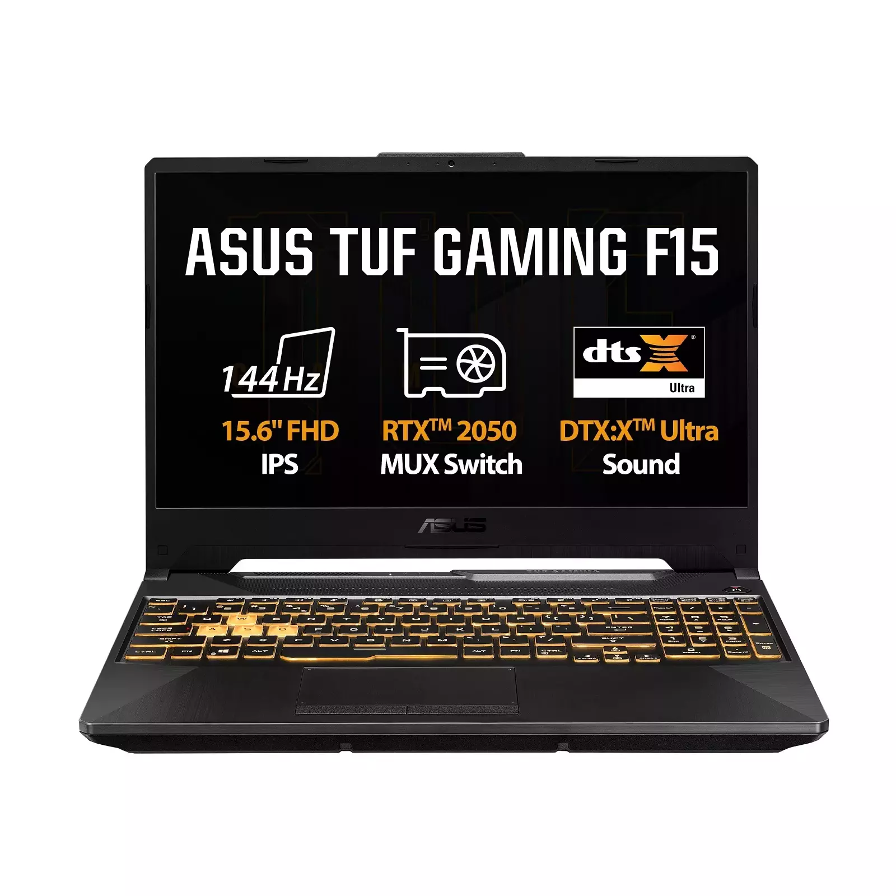

# ASUS TUF Gaming F15 Review

## Quick Specs
- **Processor**: Intel Core i7-12700H
- **Graphics**: NVIDIA GeForce RTX 4060
- **RAM**: 16GB DDR5
- **Display**: 15.6" FHD 144Hz IPS
- **Storage**: 1TB NVMe SSD

## Performance Tests

### Gaming Performance
| Game Title | Resolution | Settings | Avg FPS |
|------------|------------|----------|---------|
| Cyberpunk 2077 | 1080p | High | 65-75 FPS |
| Call of Duty | 1080p | Ultra | 90-110 FPS |
| Fortnite | 1080p | Epic | 120-140 FPS |

### Benchmark Scores
- **3DMark Time Spy**: 9,200
- **Cinebench R23**: 13,500
- **PCMark 10**: 6,500

## Design & Build
- **Weight**: 2.2 kg
- **Keyboard**: RGB backlit
- **Military-grade** durability

## Thermal Performance
- **Idle**: 40-45°C
- **Gaming**: 75-85°C
- **Cooling**: Dual fan system

## Battery Life
- **Gaming**: 1.5-2 hours
- **Video Playback**: 6-8 hours

## Pros & Cons

### ✅ Pros
- Excellent gaming performance
- Durable military-grade build
- Good thermal management

### ❌ Cons
- Display color accuracy could be better
- Bulky and heavy

## Verdict
**Rating: 8.5/10**

The ASUS TUF Gaming F15 offers excellent value for budget-conscious gamers, delivering strong performance with reliable build quality.

---

[← Back to all laptops reviews]()