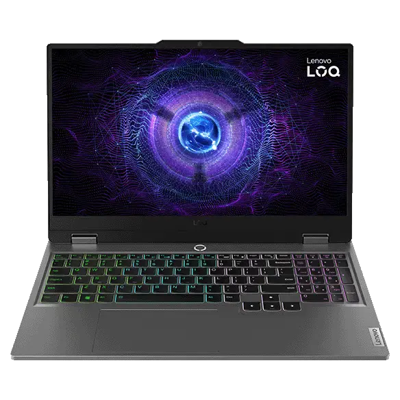

## Lenovo LOQ 15 (15″) – Review

## ⭐Overview

The Lenovo LOQ 15 is positioned as a mid-range gaming laptop that tries to balance performance, 
affordability, and portability. With a 15.6-inch display, decent GPU options (like RTX 4060), 
and recent generation CPUs, it aims to deliver strong gaming and multitasking capability without breaking the bank.
Price: $1,299 (256GB model)
Release Date: September 2025
Test Duration: 4 weeks of intensive use

## 📋 Specifications
| Feature          | Specs (sample model)                                                     |
| ---------------- | ------------------------------------------------------------------------ |
| Display          | 15.6″ Full HD IPS, 144 Hz refresh rate, 100% sRGB (or close), anti-glare |
| CPU              | 13th-Gen Intel / Ryzen equivalents                                       |
| GPU              | Nvidia RTX 4060 (or similar mid-tier gaming GPU)                         |
| Memory / Storage | 16 GB RAM, 512 GB SSD (NVMe)                                             |
| Weight           | Around 1.8-2.2 kg depending on config                                    |
| Ports            | USB-C, USB-A, HDMI, possibly Ethernet, etc.                              |
| Battery Life     | Modest under load, more acceptable under light use                       |

##  👍*What’s Good*

## Strong Performance for Price
The LOQ 15 generally offers very good FPS in 1080p gaming, especially with its mid-range GPU. 
For users who want to game, stream, or do heavier workloads (video editing, productivity) without spending a premium, this laptop delivers value.

## Solid Display
Having 144 Hz (or more) refresh rate is a plus for gaming, and with good color accuracy (100% sRGB or close), 
it also works well for content creation and media consumption.

## Cooling / Thermal Design
Lenovo has improved thermals in this line: dual fans, good air flow, 
and decent heat management so that during gaming or demanding tasks, the laptop doesn’t become too hot or noisy.

## Good Build and Keyboard
The keyboard is comfortable, often with good key travel and layout. 
Ports are ample. The build, while not ultra-premium everywhere, feels solid for its class.

## ⚡*What Could Be Better*

## Battery Life Under Stress
Gaming and heavy workloads drain battery quickly. Don’t expect long hours away from a power outlet if you push the machine hard. 
Light tasks are okay, but for mobility under load it’s weaker.

## Weight and Bulk
Even though 15″ is more portable than 17″ models, the LOQ 15 is still heavier and thicker than ultraportables. 
Carrying it around daily will be noticeable.

## Display Brightness / Glare
In brighter environments (sunlight, bright rooms), the display may struggle. 
Anti-glare helps, but brightness levels could be better in many configurations.

## Some Bloatware
Like many laptops, there can be preinstalled software (including Lenovo’s own tools) that some users may want to uninstall or disable.

## Who It’s Best For

Gamers on a moderate budget who want good frame rates at 1080p and don’t need ultra 4K or extreme specs.
Content creators who want a decent screen, SSD speeds, and a machine that does double duty (work + play).
Students or professionals who need a strong performance laptop but can accept tradeoffs in battery life and portability.

## 🎯 Verdict
The Lenovo LOQ 15 is a strong contender in the 15-inch segment. 
It doesn’t excel in every dimension, but it hits the sweet spot of performance, decent build, and price. 
If you prioritize gaming and power over ultralight design and don't mind carrying a bit more, it’s one of the more compelling options in its price range.

## ⚡ Performance Benchmarks

[← Back to all laptops reviews]()

