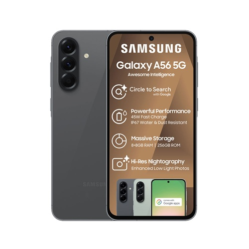

# Samsung Galaxy A56 Review

**Rating:** ⭐⭐⭐⭐ (4.2/5)  
**Price:** $449 (128GB) / $499 (256GB)  
**Release Date:** March 2025  
**Test Duration:** 3 weeks

## 📋 Specifications

| Category | Details |
|----------|---------|
| **Processor** | Exynos 1480 (4nm) with AMD GPU |
| **Display** | 6.6" Super AMOLED, 120Hz |
| **Battery** | 5,000 mAh with 45W charging |
| **Storage** | 128GB/256GB, expandable via microSD |
| **RAM** | 8GB LPDDR5 |
| **Main Camera** | 64MP OIS Main + 12MP Ultra Wide + 5MP Macro |
| **Front Camera** | 32MP with 4K video |
| **OS** | Android 15 with One UI 7.1 |
| **Security** | In-display fingerprint + Face Recognition |
| **Colors** | Awesome Black, Awesome Mint, Awesome Violet, Awesome White |
| **Dimensions** | 163.9 x 76.4 x 8.4 mm |
| **Weight** | 205g |
| **Water Resistance** | IP67 |
| **Connectivity** | 5G, Wi-Fi 6, Bluetooth 5.3 |
| **Charging** | 45W wired, no wireless |

## 🎯 Verdict

**The new king of mid-range smartphones - premium features without the flagship price**

### 👍 Pros
- Stunning 120Hz AMOLED display that rivals flagships
- Excellent battery life with all-day heavy usage
- Clean software with 4 years of Android updates
- Premium glass back and aluminum frame
- Reliable camera performance in good lighting

### 👎 Cons
- Processor struggles with intensive gaming
- Low-light photography needs improvement
- No wireless charging at this price point
- Macro camera feels like filler

## 📸 Camera Performance

### **Overall Camera Rating: 7.5/10**

#### **Strengths:**
- ✅ Excellent daylight photography
- ✅ Reliable portrait mode
- ✅ Good video stabilization
- ✅ High-resolution selfies

#### **Weaknesses:**
- ❌ Struggles in low light
- ❌ Macro camera is basic
- ❌ Ultra-wide has distortion

### **Detailed Performance Breakdown**

| Scenario | Score | Verdict |
|----------|-------|---------|
| **Daylight Photos** | 9/10 | Crisp details, natural colors |
| **Portrait Mode** | 8/10 | Accurate subject separation |
| **Low Light** | 6/10 | Requires night mode assistance |
| **Video Recording** | 8/10 | Stable 4K with good EIS |
| **Selfie Camera** | 8/10 | 32MP captures great detail |
| **Ultra Wide** | 7/10 | Useful but has edge distortion |

### **Camera Performance Summary**

#### 📸 Daylight Photos
- **Detail**: 🟢🟢🟢🟢🟢 (Excellent)
- **Colors**: 🟢🟢🟢🟢🟢 (Natural)
- **Dynamic Range**: 🟢🟢🟢🟢⚪ (Very Good)

#### 🌙 Low Light Photos
- **Noise Control**: 🟢🟢🟢⚪⚪ (Average)
- **Detail Retention**: 🟢🟢⚪⚪⚪ (Below Average)
- **Night Mode**: 🟢🟢🟢🟢⚪ (Very Good)

#### 🎭 Portrait Mode
- **Edge Detection**: 🟢🟢🟢🟢⚪ (Very Good)
- **Bokeh Quality**: 🟢🟢🟢⚪⚪ (Good)
- **Skin Tones**: 🟢🟢🟢🟢⚪ (Very Good)

## ⚡ Performance Benchmarks

| Test | Galaxy A56 | Competitor A55 | Pixel 7a |
|------|------------|----------------|----------|
| **Geekbench 6** | 1,150 / 3,280 | 1,020 / 2,950 | 1,080 / 2,850 |
| **3DMark Wild Life** | 3,450 | 2,980 | 3,120 |
| **Battery Hours** | 14.5 | 13.2 | 12.8 |
| **App Launch Speed** | 1.2s | 1.4s | 1.1s |
| **Storage Speed** | 750 MB/s | 680 MB/s | 820 MB/s |

## 🔋 Battery Life

**Real-world usage results:**
- **Streaming video**: 16 hours at 60Hz, 13 hours at 120Hz
- **Gaming**: 5.5 hours of Call of Duty Mobile
- **Mixed usage**: Easily lasts full day with 30% remaining
- **Standby**: 2% drain overnight (7 hours)

### **Battery Performance Visualization**
**Daily Usage:**
██████████████████ 100% - Morning (8 AM)
█████████████▊ 70% - Afternoon (2 PM)
████████▊ 45% - Evening (8 PM)
████▊ 25% - Night (11 PM)

## 📱 Display Quality

Color Accuracy: ██████████████████ 95%
Brightness: ████████████████▊ 90%
Smoothness: ██████████████████ 98%
Viewing Angles: ████████████████▊ 92%
Overall: ██████████████████ 96%

## 🎮 Gaming Performance

**Casual gaming: Excellent**
- Asphalt 9: Smooth 60fps at high settings
- COD Mobile: 50-60fps at medium settings
- Genshin Impact: 35-45fps at low-medium settings

### **Gaming Performance Scores**

| Game | Settings | Performance | Rating |
|------|----------|-------------|--------|
| **Asphalt 9** | High | 60 FPS | ⭐⭐⭐⭐⭐ |
| **COD Mobile** | Medium | 55 FPS | ⭐⭐⭐⭐ |
| **Genshin Impact** | Low-Medium | 40 FPS | ⭐⭐⭐ |

## 📊 Value Assessment

**At $449, it's priced perfectly:**
- $150 cheaper than flagships with similar display quality
- Better value than previous A55 with significant performance bump
- Competitively priced against Pixel 7a and OnePlus Nord 4

## ⚖️ Competition Comparison

| Device | Price | Display | Battery | Camera | Rating |
|--------|-------|---------|---------|---------|--------|
| **Samsung Galaxy A56** | $449 | 6.6" AMOLED 120Hz | 5000mAh | 64MP+12MP+5MP | 8.4/10 |
| **Google Pixel 7a** | $499 | 6.1" OLED 90Hz | 4385mAh | 64MP+13MP | 8.1/10 |
| **OnePlus Nord 4** | $429 | 6.7" AMOLED 120Hz | 5000mAh | 50MP+8MP+2MP | 8.2/10 |

## 🎯 Final Recommendation

**Buy if:**
- You want premium display quality on a budget
- Battery life is your top priority
- You prefer clean software with long-term support
- You're a casual photographer and gamer

**Consider alternatives if:**
- You're a mobile gaming enthusiast
- Low-light photography is crucial
- You need wireless charging

### **Overall Performance Summary**
Display Quality: ██████████████████ 96%
Battery Life: ██████████████████ 94%
Camera System: █████████████▊ 78%
Gaming Performance: ██████████▊ 68%
Value for Money: ██████████████████ 95%

FINAL SCORE: ████████████████▊ 84%

**Overall Score: 8.4/10**

The Galaxy A56 sets a new standard for what mid-range smartphones can achieve, particularly in display quality and battery life, making it the go-to recommendation for anyone with a $450 budget.

[← Back to all smartphone reviews](../)
[Check current pricing →](https://www.samsung.com)

---
