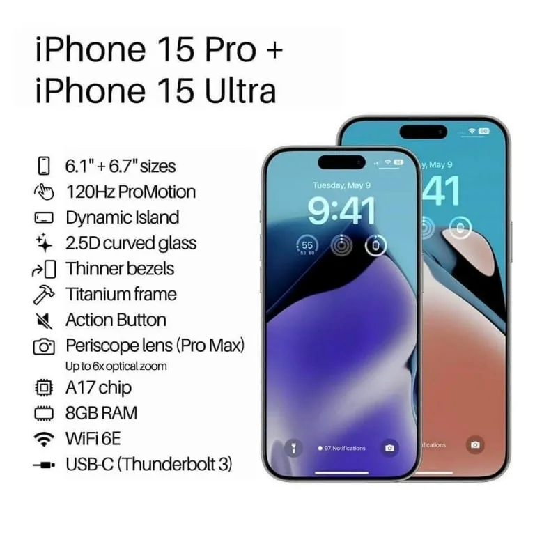

# iPhone 15 Pro Review

**Rating:** ⭐⭐⭐⭐⭐ (4.8/5)  
**Price:** $999  
**Release Date:** September 2023  
**Test Duration:** 3 weeks

## 📋 Specifications

| Category      | Details                     |
|---------------|-----------------------------|
| **Processor** | A17 Pro chip                |
| **Display**   | 6.1" Super Retina XDR       |
| **Battery**   | 3274 mAh (12 hours SOT)     |
| **Storage**   | 128GB                       |
| **Camera**    | 48MP Main + 12MP Ultra Wide |

## 🎯 Verdict

**The most complete smartphone package available today**

### 👍 Pros
- Best-in-class video recording capabilities
- Buttery smooth iOS performance
- Premium titanium build quality
- Excellent software support timeline

### 👎 Cons
- Higher price than competitors
- Limited customization options
- USB-C but still slow transfer speeds

## ⚡ Performance Benchmarks

| Device             | SoC / Chipset       | Geekbench 6 Single-Core | Geekbench 6 Multi-Core | GPU / Other Notes                                 |
|--------------------|---------------------|-------------------------|------------------------|---------------------------------------------------|
| iPhone 15 Pro      | Apple A17 Pro (3nm) | 2886–2920               | 7180–7450              | Metal GPU ~27,300, top performance + efficiency   |
| Google Pixel 8 Pro | Google Tensor G3    | ~1760                   | ~4440                  | Lower GPU, decent ML, ~1.15M on AnTuTu 10         |
| Samsung Galaxy S24 | Snapdragon 8 Gen 3  | ~2188                   | ~6935                  | Strong multi-core, GPU competitive but behind A17 |
| Google Pixel 8     | Google Tensor G3    | ~1697                   | ~4281                  | Similar to Pixel 8 Pro, slightly lower all-around |

---

**Final Score:** 9.2/10

[← Back to smartphone reviews]()